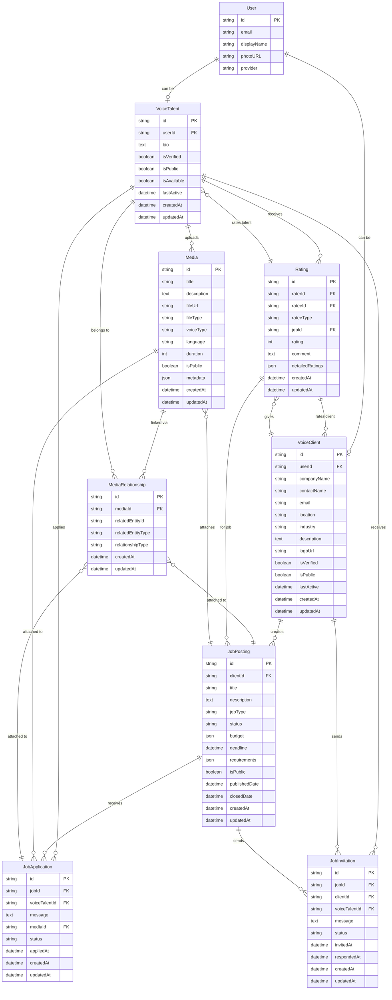
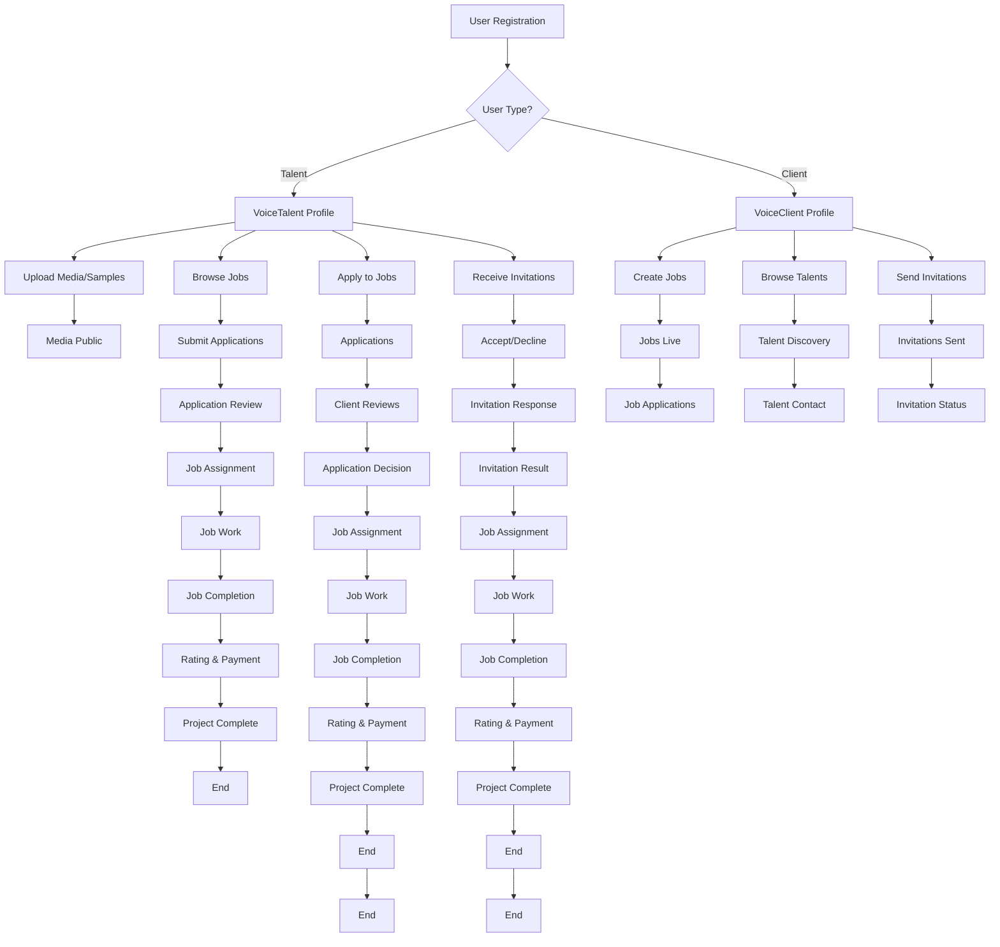

# VoiceTalents.AI - ERD (MVP)

## Core Entity Relationships

## Business Flow

## Entity Categories

### Core User Entities

- **User**: Base authentication entity
- **VoiceTalent**: Voice talent profiles (renamed from VoiceTalents)
- **VoiceClient**: Client company profiles

### Content & Media Entities

- **Media**: Unified file management system (replaces VoiceSample, CustomSample, Studio info, and all file attachments)
  - Voice samples, custom samples, job attachments, studio photos, and all other files
  - Includes voice-specific metadata (voiceType, language, duration)
  - Linked to entities via MediaRelationship

### Job Management System

- **JobPosting**: Job opportunities posted by clients (includes casting sessions as a job type)
- **JobApplication**: Talent applications to jobs (replaces CastingProposal)
- **JobInvitation**: Direct invitations to talents for specific jobs (renamed from TalentInvitation)

### Rating & Review System

- **Rating**: Review and rating system for both talents and clients
- **MediaRelationship**: Links media files to various entities

### Supporting Entities

- **Title**: Professional titles/credentials
- **Organization**: Company/organization data
- **Contact**: Contact information
- **Member**: Organization membership
- **Revenue**: Financial tracking
- **VoiceLibrary**: Voice collections
- **OrganizationContact**: Organization contact associations
- **Payout**: Payment processing
- **RevenueDistribution**: Revenue sharing
- **Profile**: User profile data
- **ProfileTitleList**: Profile title associations
- **ViewingProgress**: Content viewing tracking

## Key Business Rules

1. **User Identity**: Each user can be either a VoiceTalent OR a VoiceClient, not both
2. **Job Applications**: VoiceTalents can apply to multiple JobPostings
3. **Job Invitations**: VoiceClients can invite multiple VoiceTalents to specific jobs
4. **Casting Sessions**: Are just a type of JobPosting (jobType = "casting")
5. **Media Management**: All files (voice samples, custom samples, job attachments, studio photos) are managed through the unified Media entity with relationships
6. **Job Lifecycle**: Jobs move through Draft → Published → Active → Completed states
7. **Application Status**: Applications can be Pending → Under Review → Shortlisted → Accepted/Rejected
8. **Job Types**: Open Casting, Direct Hire, Custom (no separate Campaign entity)
9. **Rating System**: Both talents and clients can rate each other after job completion

## Status Enums

### Voice Types

- Male, Female, Child, Teen, Adult, Senior, Character, Narrator, Announcer

### Project Types

- Commercial, Audiobook, Animation, Video Game, Podcast, E-learning, IVR, Other

### Job Types

- Open Casting, Direct Hire, Custom

### Status Types

- Draft, Published, Active, Completed, Cancelled, Pending, Approved, Rejected

### Application Status

- Pending, Under Review, Shortlisted, Rejected, Accepted, Withdrawn

### Invitation Status

- Pending, Accepted, Declined, Expired

### Rating Types

- Talent Rating (client rates talent)
- Client Rating (talent rates client)
- Job Rating (rating for specific job)
