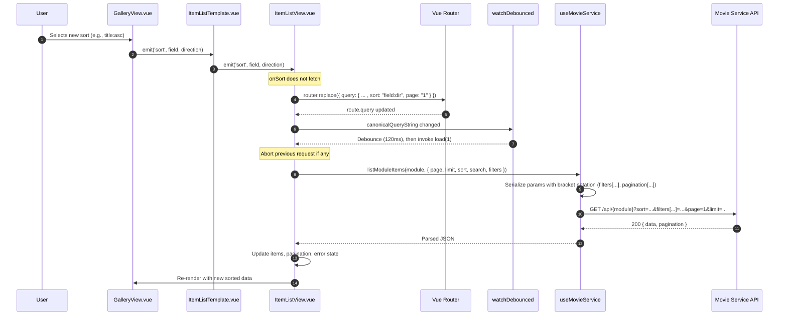

### Gallery view: change "Sorted by" sequence

This documents what happens when the user changes the sort option in the Gallery view.

Key notes
- onSort only updates the URL; fetching is centralized via a debounced watcher on a canonical query string.
- The debounced watcher coalesces rapid changes and triggers a single load(1).
- Request building uses backend-style query params (e.g., `filters[dateField][$between]`).
- In-flight requests are aborted before a new fetch to avoid races.
- Pagination resets to page 1 on sort change.

Error handling
- Network or server errors are caught; the error message is surfaced in the view.
- Non-JSON responses are guarded in `useMovieService.request` with helpful diagnostics.

Extensibility
- To add additional filters, write them to the URL in backend format; the canonical watcher will fetch.
- To adjust debounce behavior, tune the `watchDebounced` timing in `ItemListView.vue`.

